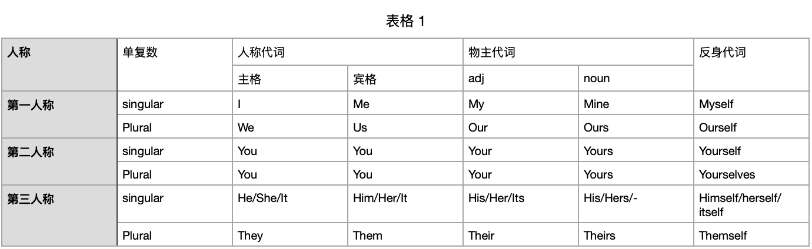

# English grammar
重新学习语法的过程中，突然认识到，绝大多数的语言都是约定俗成的东西，而且处在不断变化的过程中，并不是先确定一套规则，然后再发明的语言。所以，其实是先有语言，后才有语法。这就好比硬搬一个公式，往语言上去套，结果当然会有很多不符合的地方，所以语法也并不是一成不变的。  

## 1. 词性
了解词性是了解语法的第一步。

### 1.1 名词
英语中的名词包括: things, people, ideals, places这几类，名词可以充当句子的主语和宾语。关于名词除了单数和复数其实没太多可说的。  

#### 1.1.1 名词的复数
名词的单数变复数规则变化就是加s，不规则变化主要有以下几类：
1. 以f结尾，改f为ve + s
2. 以y结尾改y为ie + s
3. child -> children（独成一派）
4. 不变，sheep, fish。（注意fishes是指种群，不是鱼的复数）
5. 外来词，有一些奇怪的变化形式，常见的如下。  
> fungus -> fungi
> datum -> data
> index -> indice 
> matrix -> matrice
> thesis -> theses
> criterion -> criteria 
> phenomenon -> phenomena 
6. 突变词
> foot  -> feet
> woman -> women
> man   -> men
> tooth -> teeth
> goose -> geese
> mouse -> mice
> louse -> lice  

关于单数变复数，最后这两类5和6，有一些事很常见的，不需要刻意去记，另外一些不常见的，除非是写论文，日常使用加s也没什么大问题，只要能理解就行。英语在发展过程中，有一些不规则变化形式慢慢的用的人会越来越少，甚至消失（native speaker自己说的，不是我说的）。

#### 1.1.2 冠词
两类冠词，定冠词(definite artical)，不定冠词(Indefinite artical)。
| definite | Indefinite |
| -- | -- |
| spesific | unspecific |  
| both singular & plural| only singular|  
The xxx，指具体某一个东西（可能在上文中有提到过，可能是配合动作，或者是很著名的，大家都知道的）。a/an就是很随便的任意一个。

### 1.2 动词(verb)
动词大体上可以分为3类：最普通的动词可以表示物体的运动，助动词和情态动词可以辅助其他动词，系动词可以连接概念，。

#### 1.2.1 助动词&情态动词
auxiliary verb，也称helping verb，是用来辅助main verb表达tense，mood，voice。助动词总共就仨，be, do, have。另外，情态动词也属于助动词的一种，情态动词包括：can, could, may, might, must, ought to, shall, should, will, would。
下面结合栗子🌰，分别说一下什么是tense, mood, voice。
- tense
即所谓的时态。助动词辅助表达时态很常见，随便就可以举出来一些例子。
    > I play vedio games. 
    > I `am` playing vedio game. 
    > I `have` played vedio game for an hour.
    > I `will` play vedio game after work.
- mood
用来辅助表达说话者的态度和语气：
    - 陈述(indicative mood)
    - 祈使(imperative mood)
    - 虚拟(subjunctive mood)
        > I wish it `were` true.
    - 疑问(interrogative mood)
        > `Do` you know him ?
        > `Have` you seen it ?
    - 条件(conditional mood)
- voice
主要分为active voice和passive voice，主动和被动。助动词可以用于辅助表达被动语态。
    > Our dessert `was` eaten by the dog.
    > The dog eat our dessert.

### 1.2.2 系动词
英语里面叫linking verb，可以连接概念，或者说表示状态。常见的系动词有is/are/was/were/be/been/being.  
> The bear `is` hungry.  
> The bear `looked` lonely.  
> The bear `smells` like cinnamon.  

以上的句子中的系动词，is/looked/smells把后面的补语hungry/lonely/cinnamon和前面的主语联系到了一起，两者之间建立了关系.


### 1.3 代词
代词用于指代前后语境中已经出现过的名词，形容词和量词，避免重复。根据所指代的内容不同进行分类。
#### 1.3.1 人称代词，物主代词，反身代词

记住这个表就基本差不多了，有几个地方需要说明的。
**宾格和主格：** 很容易理解，主格就是可以充当句子的主语，宾格就是只能充当句子的宾语。举个栗子。
> `I` eat a cookie.
> You ask `me`, me ask who ?

主格可以是动作的发起者，宾格只能是动作的接收者。
**形容词性和名词性：**
> This is `my` book.
> This book is `mine`.
> A: Where is your book ? 
> B: `Mine` is at home.  

第一句中my作为形容词，修饰book。第二句中，mine作为名词，充当句子的补语。  
**反身代词：** 如果一个句子中动作的执行者和动作的接受者都是同一个东西，那么后一个就要用反身代词。
> Jimmy made `himself` breakfast.
反身代词还有一种特殊的用法，就是用来表示强调的语气。
The princess `herself` will be there.
I'll do it myself.

### 1.3.2 关系代词
用于连接独立从句和非独立从句。关系代词有：`who, whom, whose, that, which。`
**that和which：** 
that不适用于逗号
> The carrot, `which` was oringe, was tasty. (NR) &#10004;  
> The carrot `which` was oringe was tasty. (R) &#10004;  
> The carrot, `that` was oringe, was tasty.  &cross;
> The carrot `that` was oringe was tasty.  &#10004;   

which不适用于人  
> The dog `that` I saw.&#10004;  
> The snow `that` fell.&#10004;  
> The women `that` boarded the plane.&#10004;  
> The dog `which` I saw.&#10004;  
> The snow `which` fell. &#10004;   
> The women `which` boarded the plane.  &cross;  

**who和whom：** 
严格从语法角度来看，who应该用作主格，whom用作宾格。但是随着语言的发展，whom的作用逐渐被who所取代，并渐渐退出历史舞台。所以在倒装句中，用who都没毛病，但是要注意的是，如果直接接在介词后面，还是要用whom。
> The spy who  loved me. &#10004;  
> The spy whom I loved. &#10004;  
> The spy who  I loved. &#10004;  
> The spy whom loved me. &cross;  
> You are talking to who ?&cross;  
> Who are you talking to ? &#10004;  

#### 1.3.3 不定代词（Indefinite pronoun）
Indefinite means undefined, uncertain. 
any, anybody, each, everyone, nobody, some, both, neither, either.
cool things about Indefinite pronouns: 
1. both can be used as subj and obj.
2. both, neither, either retain the DUAL.
3. usually treated as singular.  

**They用作单数**
Everybody has `their` failing，you know, and everybody has a right to do what `they` like with `their` own money.
这里的they指代前面的everybody，本来应该用单数，以前的语法里面认为应该用his来指代everybody，但是现代女权主义者认为这是性别歧视，所以现代语法主张they也可用作单数。

### 1.4 形容词
形容词起修饰名词的作用。
#### 1.4.1 形容词顺序
一个句子中可能有很多形容词，那么这些词应该满足怎样的顺序？
> French old white house.  
> Old white French house.  

具体的顺序表很长，但是基本上，只要知道，越是根本的属性，就越接近名词，基本上就没问题。
#### 1.4.2 形容词比较级
- 单音，e结尾：cute，cuter，cutest
- 单音，辅音结尾：big, bigger, biggest
- 2音，y结尾：shiny, shinier, shiniest
- 多音，比如4个：magnificent，就用more和most

### 1.5 副词
副词修饰除了名词和代词以外的所有词。
- 副词可以修饰动词：
> Greyson ran `slowly`.
- 副词可以修饰形容词：
> Vanessa was `very` hungry.
- 副词多以-ly结尾

### 1.6 介词
preposition，describe where/when/how things are.
#### 1.6.1 时间介词
- After/before
- At : precise time point.
- by : precision of end.
- for: duration
- in : bounded duration
- on : specific day
- since : precise begining
- until : precise ending

#### 1.6.2 空间介词
- at: apoint, direction
- by: near
- from: somewhere else to here 
- in: an closed area
- off: away from surface, she hoped off the rock
- on: surface
- out: away from closed area
- to: direction

#### 1.6.3 非空间和时间介词
about, by, for, of, with

#### 1.6.4 复合介词
between, among, around, against, within, without, inside, beyond

#### 1.6.5 介词短语
就是以介词为开始的短语。介词短语可以充当各种成分，比如形容词，副词，名词...
`To steal the Queen' s diamonds` would be a terrible crime.
A: I know a man with a wooden leg named Smith.
B: What was the name of his other leg.

### 1.7 连词
unite words, phrases and clauses.
#### 1.7.1 coordinate conjunctions
FANBOYS: For And Nor But Of Yet So 
```
For - since, because
I do not eat buttons, for they are not food.

And - combines things

Nor - combines things that are false
She won't leave her tree, nor will she speak with human.

But - expressses exception
We use every building material but chewing gum.

Or - chooses between options
Would you rather have a pet bear or a pet dog ?

Yet - on the contrery, means unexpected
I want to leave, yet I can not.

So - shows consequences
Dougal was allergic to sheep, so he skipped the wool festival.
```
#### 1.7.2 corelative conjunctions
either...or 
neither...nor 
both...and 
as...so 
whether...or  

## 2 初级句型

先介绍句子成分：
- Subject - 主语，即动作的执行者。
- Verbs - 也就是谓语，其实英语里面就是动词，每句话都一定有动词。
- Object - 宾语，动作的接受者。
- Complements - 补语，a part of a clause that usually follows the verb in English and adds more information about the subject or object。  
- modifier - 定语，广义上的形容词，起到形容词的作用的clause，可以是形容词、介词短语或者从句。
- adverb modifier - 状语，广义上的状语，起副词作用的clause，可以是副词，介词短语或者从句。 
 
### 2.1 基本句型及补语
英语中有5种最基本的句型：
1. S + V.  
><ins>Racheal</ins> <ins>laughs</ins>.   
2. S + V + O.  
> <ins>Racheal</ins> <ins>likes</ins> <ins>me</ins> .  
3. S + V + C.  
> <ins>Racheal</ins> <ins>is</ins> <ins>beautiful</ins> .  
4. S + V + O + C.  
> <ins>I</ins> <ins>think</ins> <ins>her</ins> <ins>pretty</ins>.  
5. S + V + O + O.  
> <ins>She</ins> <ins>gives</ins> <ins>me</ins> <ins>a book</ins>.   
有的语法书里面会把s + v + c这种句子称为主系表，主语加系动词加表语。  

这五种句型中最难理解的可能是补语。英语中所有的系动词都是没有含义的，可以翻译为中文中的‘是’，换而言之，英语中所有可以翻译为是的单词，都是系动词。请看以下的例子。

> be, look, seem, appear, sound, feel, taste, turn, prove, become, make
> John Smith <ins>is</ins> a soldier.    
> The dress `looks` pretty.  
> The dog `seems` friendly.  
> His demands `appear` reasonable.  
> His trip `sounds` exciting.  
> I `feel` sick.  
> The drug `tastes` bitter.  
> The story `proved` false.  
> He `become` a teacher.  
> A nurse `makes` a good wife.  

S + V + O和S + V + C最核心的区别就是，S + V + C中的V是系动词，而S + V + O中的V是及物动词。S + V + O中的O表示动作作用的对象，C则是对主语的补充说明。  
S + V + C中的C如果是对主语的补充说明，也就很容易想到， S + V + O + C中的C就是对宾语的补充说明。区分S + V + O + C 和 S + V + O + O的方法很简单，就是在OC或者OO之间插入一个系动词，看能不能解释得通。比如：
> John's father give him a dog.  （S + V + O + O）  
> John's father called him a dog. （S + V + O + C） 
>   
第一句，he is a dog显然和原句的意义背离，但是第二句，翻译为中文就是‘他爸爸骂他是狗’，显然是没问题的。

### 2.2  名词短语和冠词

在名词短语的开头会有一些单词来限定名词的范围，在语法上称为限定词（determiners）。冠词就是限定词的一种。
> a new book  
> many good students  
> his beautiful wife  
> the best answer  
> those sweet rose  

上面的名词短语由三部分组成：限定词（a，many，his，the...），形容词和名词。首先，形容词位置肯定是可省略的。限定词是否能省略要看具体情况，下面来讨论这些情况。  
#### **冠词a(n)**  
---
- 是否可数  
a(n)是表示one(一个)的意思，如果可数名词，单数形式就要加a(n)，复数就要加s。如果是不可数名词，就不需要。  
- 专用名词
人名和地名等专用名词，因为其唯一性，不需要特别说明一个，所以不需要a(n)。但是有些名词在某些语境下只有一个，其他语境下可能有多个。  
    > There are five Sundays this month.
    > I have an appointment on Sunday.  
- 补语
补语和其被补充的成分具有同等的关系，如果主语（宾语）是专有名词，则其补语也被当成专有名词使用。其实简单的说，就是如果可以有多个的情况下，就要特别说明a(n)，来指明是其中的一个，而如果很明确，就只能有一个，就不需要加a(n)。

#### **定冠词the**
---
the在语源学上可视为that或those的弱化形式。所以the也可以用和that同样的角度来解释：凡是上下文中有明指或者暗指是，也就是有“那个”的指示功能时，便要使用定冠词the。  
> I need a book to read on my trip.
> I have finished the book you lent me.

第一句中a book可以指任意一本书，而第二句中的the book明确表明了是你借给我的那本书。  
**专有名词**  
专有名词因其唯一性，所以不需要用一个/这个/那个这样的冠词，所以不需要the。但是有些语法书上会说，海洋、河流、群岛、群山、杂志等，是专有名词加the的例外，需要背下来。其实完全是错误的。
> the Pacific (Ocean)  
> the Altlantic (Ocean)  
> the Indian Ocean  
> the Dead sea   
> the Titanic (Ship)  
> the Hilton (Hotel)  

这些词其实都是省略了括号内的名词，定冠词the其实修饰的是省略的名词。

### 2.3 动词时态
现代语法中，时间（time）和状态（aspect）分开处理，会大大简化时态的概念。这其中最关键的地方是把be动词当做动词，其后的分词当作形容词补语。一旦把be动词抽离开来看，那就只剩下be动词写的简单式和have been写的完成式两种。

#### 3.1 简单式
简单式可以交代出动作发生于某个时段（闭环），与之搭配的时间副词通常会明确的表示一个时间段。这个时间段既可以小到一个时间点，也可以大到无限。  

##### 过去时间
> The U.S. `established` diplomatic relations with the P.R.C `in 1979`.  

此句话中的established发生在1979年这个时间段内，且属于过去时间，所以用过去时间的简单式。

> I `was` visiting clients `the whole day yesterday`.

这句话的时间是昨天一整天，与之对应的动词，was使用简单过去式。visiting clients是现在分词短语，作为主语的补语。表示动作的持续性。

> The movable print `was` introduced to England `in 1495`.

此句中，时间也是一个过去的时间段，所以对应动词是简单过去式。introduced是过去分词做主语的形容词补语，表示被动。

##### 现在时间
如果动作发生的时间段是now所涵盖的一个时间段，就用一般现在时。而用于表示真理的句子，因为表示的是包括现在在内的一个涵盖现在与未来的区间，理所当然的也应该用一般现在时。  

> All mothers love their children.

这句话是表示不变的真理，不管是过去还是现在，未来，所以用简单现在时。  

> 7-ELEVEN `is` selling big cokes at a discount `this month`.  

this month是涵盖现在的一个时间段，所以用简单现在时。selling是现在分词，表示动作的持续性。

##### 未来时间
未来时间和简单现在时并没有什么区别。  
> Don't call me at 6 am tomorrow. I'll still be sleeping then.  
> The building will be razed next month.  

#### 3.2 完成式
完成式是一个半闭的区间，强调动作截止时间，开始的时间可以说明，也可以不说明。同样也可以分为过去，现在和未来。  

##### 现在时间  
一般情况下省略时间介词的句子，都是隐式的表示现在，而表示在此之前我做了什么，就是很明显的半开半闭区间，所以用完成式。
> I have seen that face somewhere.  
> The house has been redecorated twice (till now) since they moved in.  

这句话是说房子从他们搬进来之后到现在为止已经装修了两次，所以用现在完成式。  

##### 过去时间  
如果没有特别说明都是指至今为止，如果明确指出截止时间是过去的情况下，就可以用过去完成式。  
> Many soldiers had died from pneumonia `before the discovery of penicillin`.  

这句话明确交代了，截止盘尼西林发明之前，所以用过去完成式。  
> I had been `smoking` three packs of cigarettes a day before I `decided` to quit.  

decided是简单过去式，表示截止时间是在过去。somking three packs则是现在分词，表持续性的动作。

##### 未来时间
如果截止时间在未来，则应该用未来完成式。  
> Come back at 5. Your car `will have been` fixed `by then`.  

### 2.4 非限定性动词（动状词）
关于限定(finite)和非限定(infinite)是现代语法中的概念，所谓限定就是指动词在充当谓语的时候，需要和主语在数量和人称上保持一致，还需要承担表达动作发生时间的功能，所以受到了主语和时态的限定。而动词在句子中充当除谓语之外的其他成分，就不会有这种限定，所以叫非限定。  
限定和非限定是动词的形态，而不是动词本身具有的属性。所以同一个动词可以是限定的也可以是非限定的。  

+ 动词形态{.mindmap}
    + finite(限定)
        + simple present(-s)
        + simple past(-ed)
    + infinite(非限定)
        + infinitive（不定式）
            + 动词原形
            + to + 动词原形
        + gerund（动名词）
        + participle（分词）
            + 现在分词 -ing
            + 过去分词 -ed  

一个句子中有且只有一个动词做谓语，出现的其他动词一定是非限定性动词，或者称为动状词，是因为只是长得像动词，实际上不是做动词使用`（因为他们既不需要和主语在人称和数量上保持一致，也不用承担表达动作发生时间的作用）`。非限定性的动词有3种，那么什么时候该用哪一种呢？这就是下面要说的问题。  

#### 2.4.1 不定式
动词不定式有两种形态，一种是动词原形不定式，一种是带to的不定式。  


### 2.5 动名词
### 2.6 分词
